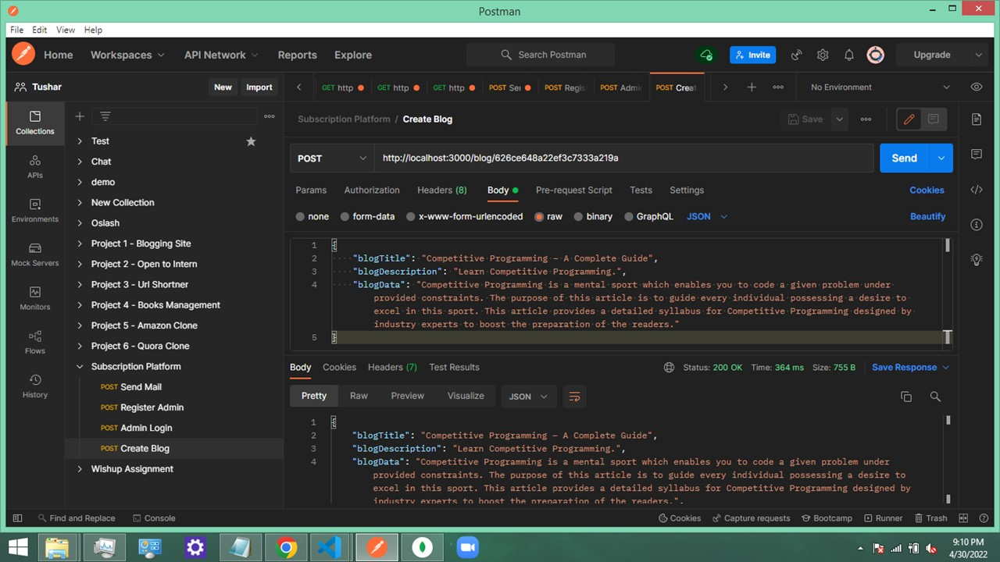
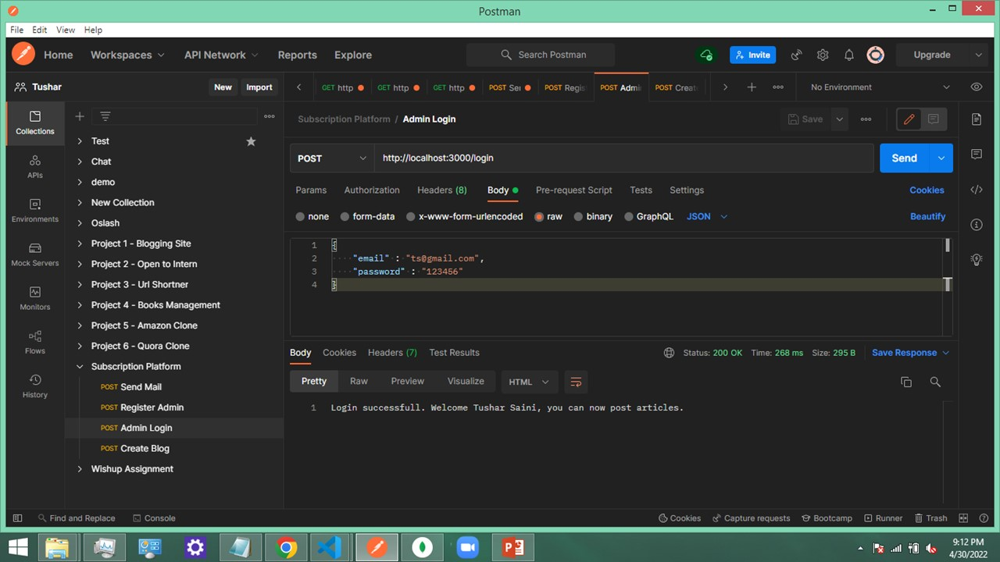
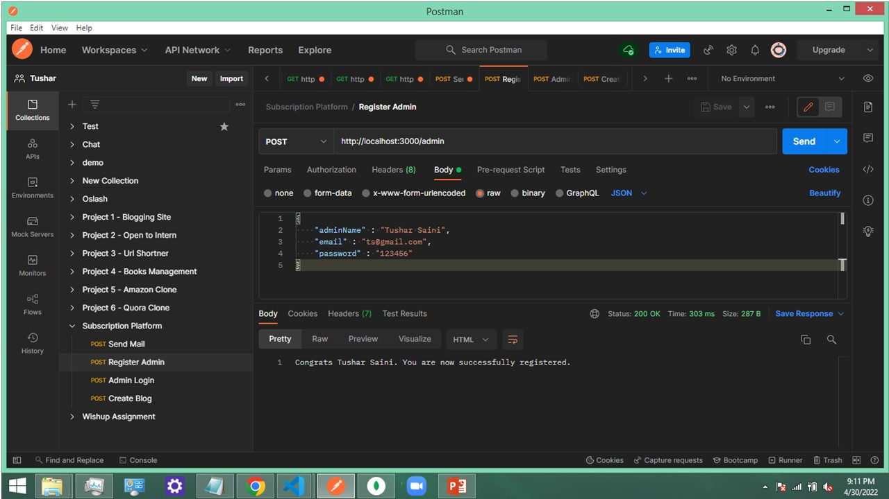
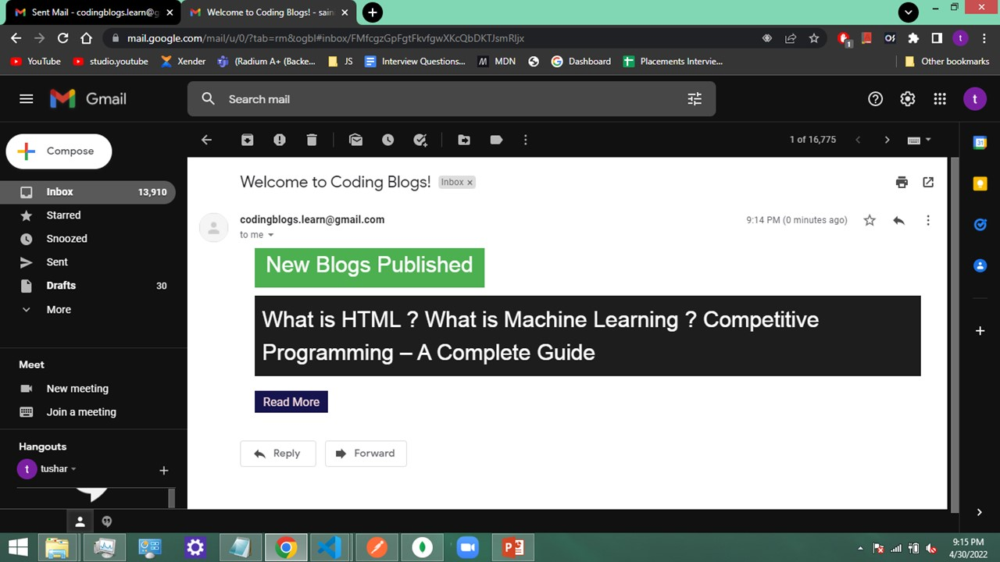

# Luezoid-assignment_Subscription-Platform

### Key points
  1) Endpoint to create a "post" for a "particular website".
  2) Endpoint to login admin and add web articles.
  3) Endpoint to make a user subscribe to a "particular website" with all the tiny validations included in it.
  4) No duplicate stories should get sent to subscribers.
  5) Deploy the code on a public github repository.

### Models
- Admin Model
```yaml
{ 
  adminName: {string, mandatory},
  email: {string, mandatory, valid email, unique},
  password: {string, mandatory, minLen 8, maxLen 15}
}
```

- Blog Model
```yaml
{ 
  blogTitle: {string, mandatory},
  blogDescription: {string, mandatory, unique},
  blogData: {string, mandatory}
}
```
  ### Postman samples
 
 
 
 

 
 
 
 
 
 ### Email sample - Used Nodemailer for sending emails to the subscribers.
 

  


